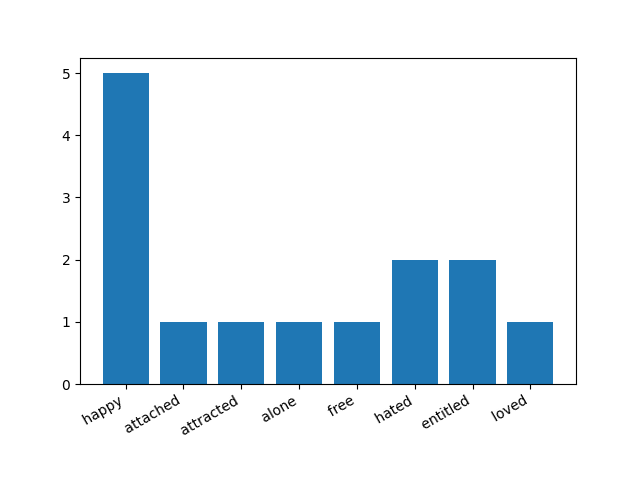

# Text Analysis using nltk

## Overview

This project performs text analysis on a given text file, including preprocessing steps such as lowercasing, removing punctuation, stop words, and lemmatization. The script then analyzes the emotions present in the text using a predefined emotion lexicon. Additionally, it conducts sentiment analysis using the VADER sentiment analyzer and visualizes the emotions in a bar graph.

## Results

The script will print the list of emotions extracted from the text and provide sentiment analysis (Negative, Positive, or Neutral).

Additionally, a bar graph (`bargraph.png`) illustrating the distribution of emotions in the text will be saved in the project directory.

